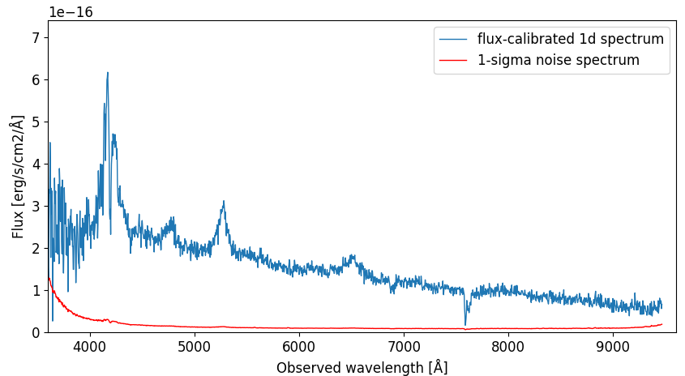

Calibration
===========

This is the final step, and it produces the calibrated 1d-spectrum.

The script is called `calibrate.py` 
The needed input are the :ref:`setup.py <setup>` file, the
:ref:`extracted 1d sceince spectrum <extract_1d>` 
(filename `obj.ms_1d.fits`), the product from the :ref:`sensfunction.py <sensfunction>`
script (filename `sens_coeff.dat`) - as well as the extinction file 
`lapalma.dat` used in the :ref:`sensfunction.py <sensfunction>` script.

The relevant file structure is therefore as follows:

.. code-block:: bash

    ├── arcsub.fits
    ├── arcsub_std.fits
    ├── calibrate.py
    ├── database
    │   ├── lapalma.dat
    │   ├── sens_coeff.dat
    ├── obj.fits
    ├── obj.ms_1d.fits
    ├── setup.py
    ├── std.fits

The script is fully automatic. While in the same directory as the `calibrate.py` 
script, run:

.. code-block:: bash

    python3 calibrate.py

The script will produce the calibrated spectrum, and plot it:

The final results are written in 2 formats:

**flux_obj.ms_1d.fits** and **flux_obj.ms_1d.dat** 
