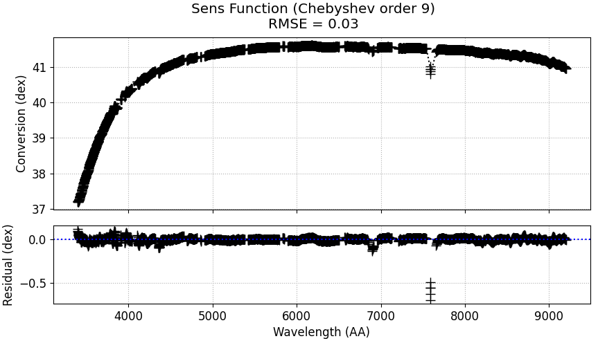

.. _sensfunction:

Sensitivity function
====================

This script uses the :ref:`calibrated standard star spectrum <standard>`
to fit a sensitivity function. The sensitivity function is a function
that describes the efficiency of the spectrograph as a function of
wavelength. The sensitivity function is used to convert the extracted
science spectrum to physical flux units.

The script used for this step is `sensfunction.py`. All output produced
while running `standard.py` is used as input for this script. Furthemore,
a file describing the atmospheric extinction is needed. This file is provided
for the tutorial, and is named `lapalma.dat` (since the data is from 
the `NOT <https://www.not.iac.es/>`_). If you are using another extinction file,
you will either need to rename it, or change the name in the script. The 
:ref:`setup.py <setup>` file is also needed.

The relevant file structure is therefore as follows:

.. code-block:: bash

    ├── arcsub.fits
    ├── arcsub_std.fits
    ├── database
    │   ├── lapalma.dat
    │   ├── stddata
    │   └── stdinfo
    ├── obj.fits
    ├── sensfunction.py
    ├── setup.py
    ├── std.fits

The script is fully automatic, and no manual interaction is needed.
When in the same directory as the `sensfunction.py` script, run:

.. code-block:: bash

    python3 sensfunction.py

And inspect that the fit is good:

, or otherwise change relevant parameters in :ref:`setup.py <setup>`
and repeat the process.

The resulting relevant file structure should look like this:

.. code-block:: bash

    ├── arcsub.fits
    ├── arcsub_std.fits
    ├── database
    │   ├── lapalma.dat
    │   ├── sens_coeff.dat
    │   ├── stddata
    │   └── stdinfo
    ├── obj.fits
    ├── sensfunction.py
    ├── setup.py
    ├── std.fits

