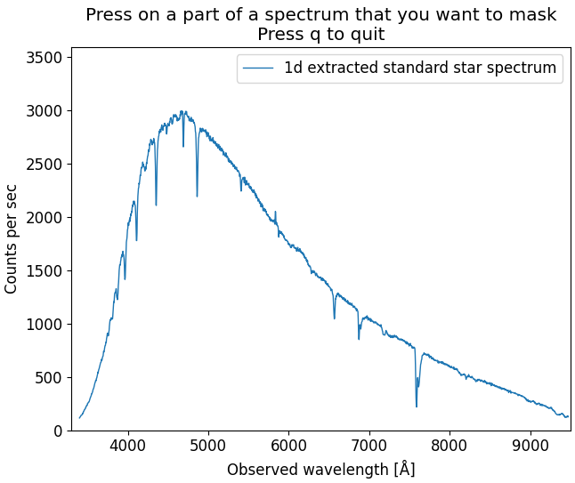
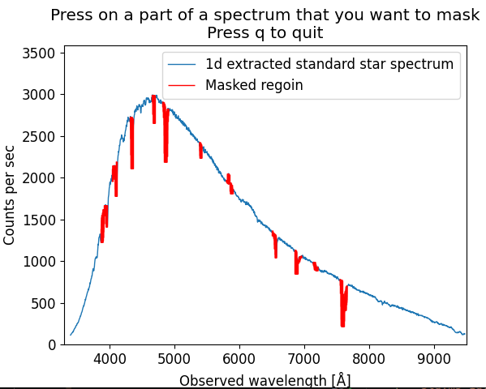

.. _standard:

Standard
========

In this step, the :ref:`extracted 1d standard star spectrum <extract_1d>` 
will be correlated with an archived spectrum from the same star that is given in 
wanted physical units. This allows to estimate detector sensitivity,
and later calibrate the science spectrum to physical flux units. 

The script used for this step is `standard.py`. The naming of 
the archived spectrum should be: "m" + starname + ".dat". For this tutorial,
the file "mfeige110.dat" is provided. This file has been downloaded
from `the ALFOSC homepage <https://www.not.iac.es/instruments/alfosc/standard_stars/>`_.
The :ref:`extracted 1d standard star spectrum <extract_1d>` will be
read from the file `std.ms_1d.dat`. The :ref:`setup.py <setup>` file is also needed.

The relevant files and directories for this step are:

.. code-block:: bash

    ├── arcsub.fits
    ├── arcsub_std.fits
    ├── mfeige110.dat
    ├── setup.py
    ├── standard.py
    ├── std.fits
    ├── std.ms_1d.dat

Only manual interaction from the user needed is manual masking of what
parts of the extracted spectrum should be omitted. Anything that would
interrupt :ref:`later fitting process <sensfunction>` should be masked - this includes visible
emission/absortion lines, and other artifacts.

First, while in the same directory as the `standard.py` script, run:

.. code-block:: bash

    python3 standard.py

This will open an interactive plot window, where you can mask the
spectrum parts by clicking on the plot. The masked parts will colored.
An example of the plot before and after masking is shown below:

When the wanted parts are masked, press "q" and the script will 
do the rest automatically, and lastly produce the output files.
The file structure after execution should now be:

.. code-block:: bash
    
    ├── arcsub.fits
    ├── arcsub_std.fits
    ├── database
    │   ├── stddata
    │   └── stdinfo
    ├── mfeige110.dat
    ├── setup.py
    ├── standard.py
    ├── std.fits
    ├── std.ms_1d.dat

